## GEN Labo3 - Monopoly

**Auteurs:**

**Barros Henriques Chris:** kurisukun

**Daubresse Gaëtan:** Gaetan2907

**Kayoumi Doran:** kayoumido

### Workflow Github

Il faut créer une organisation, **forker** le dépot et ne procéder à des modifications que via **pull request**

### Outils

**Maven**

**JUnit5:** [User guide](https://junit.org/junit5/docs/current/user-guide/)

**Travis:** [Getting Started](https://travis-ci.org/getting_started)

### Modèle itératif

Il faut suivre et implémenter les 2 premières itérations du livre Applying UML and Patterns:

**PDFs:**

[itération1](https://cyberlearn.hes-so.ch/pluginfile.php/3213185/mod_folder/content/0/iteration%201.pdf?forcedownload=1)

[itération2](https://cyberlearn.hes-so.ch/pluginfile.php/3213185/mod_folder/content/0/iteration%202.pdf?forcedownload=1)

(**Disponible en entier sur O’Reilly**):

https://learning.oreilly.com/home/

### Itération 1

**Schéma de classe:**

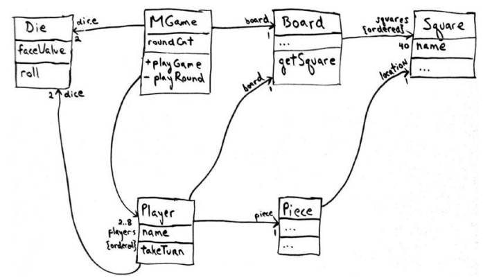

**Diagrammes de séquence:**

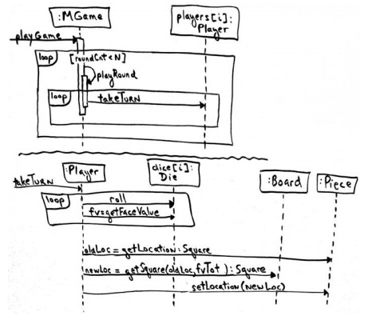

**Ordre de création des classes:**

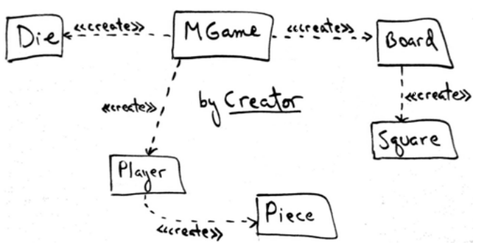

### Itération 2

**Schéma de classe:**

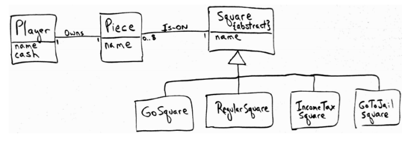

On voit que les cases ont une méthode *landedOn* spécialisée

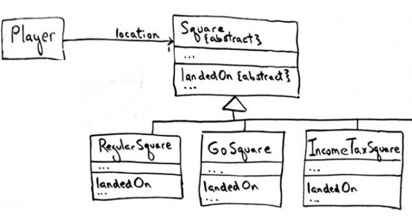

**Diagrammes de séquence:**

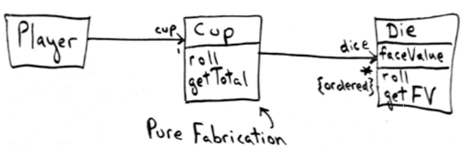

Ici, on doit ajouter une classe purement fonctionnelle (aide juste à la programmation) **Cup** avec ses méthodes. Permet de lancer un certain nombre de dés.

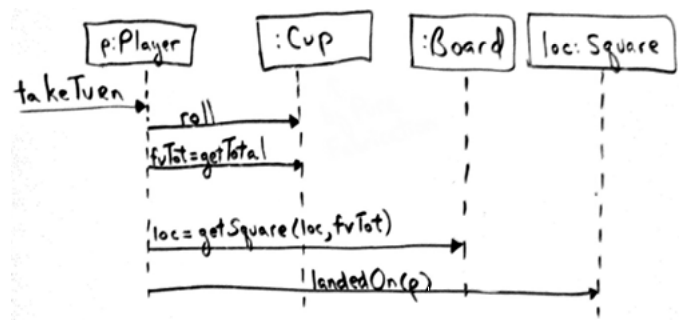

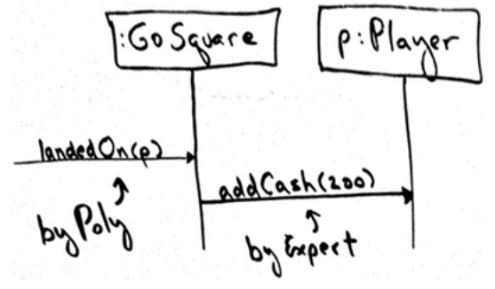

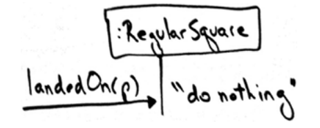

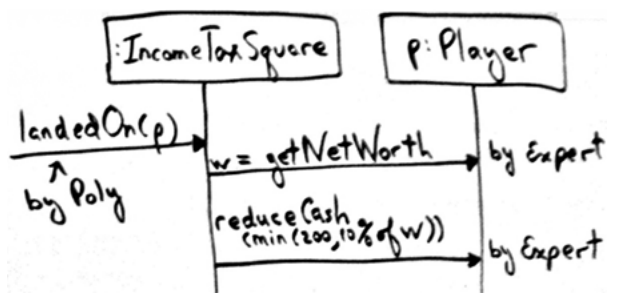

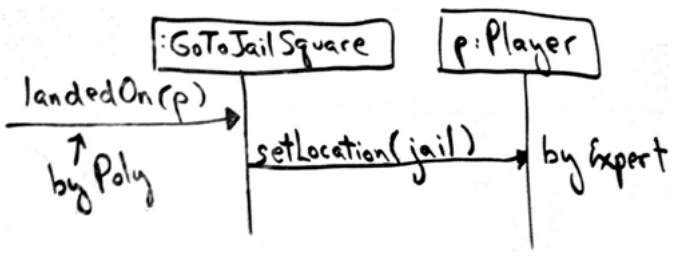

